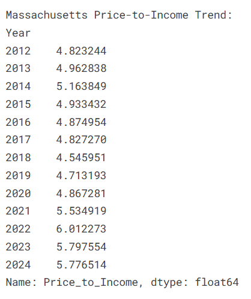
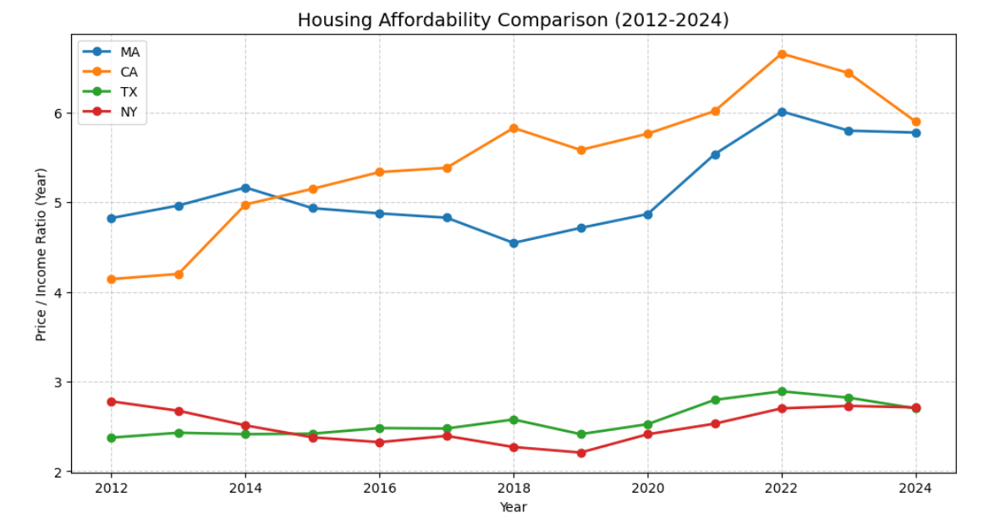
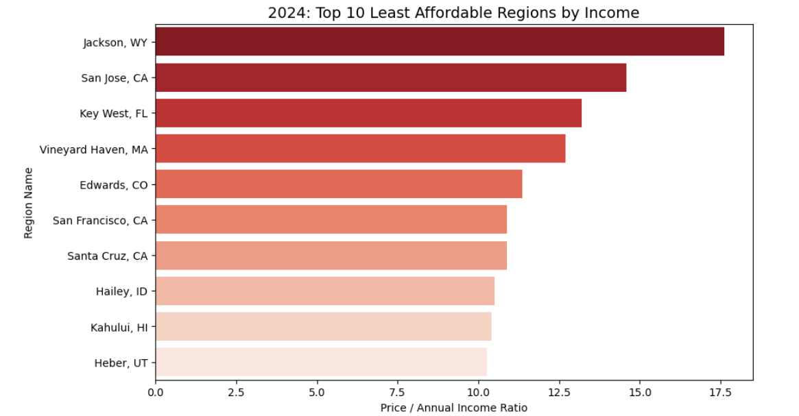
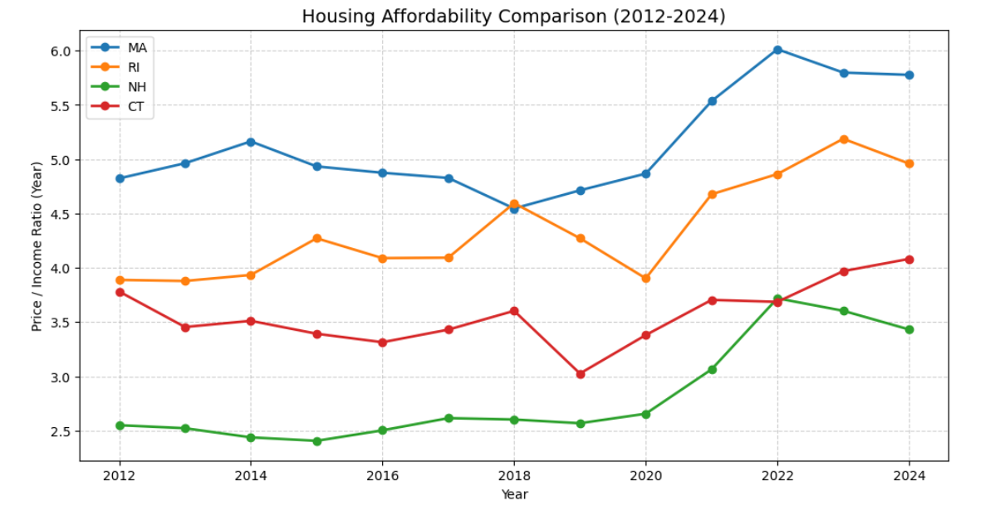
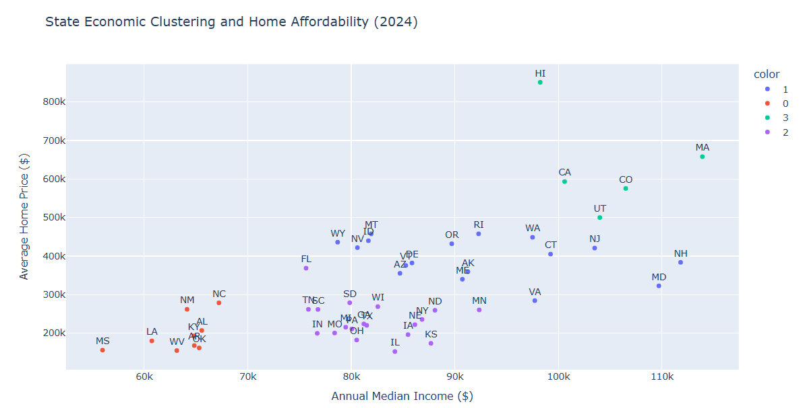
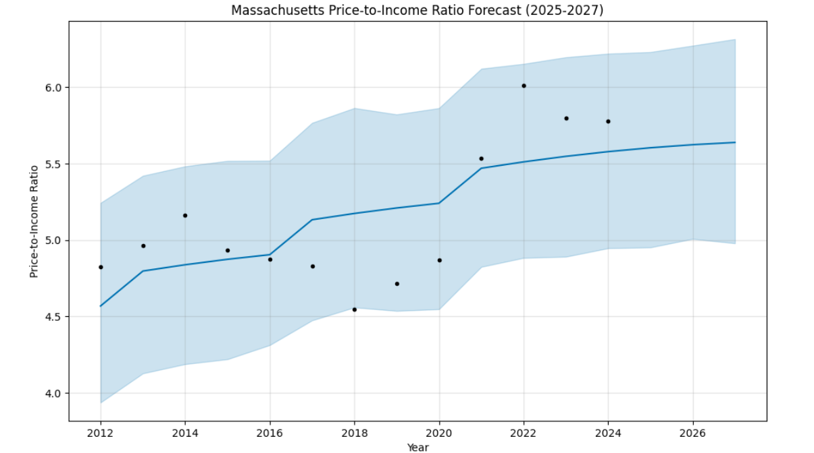
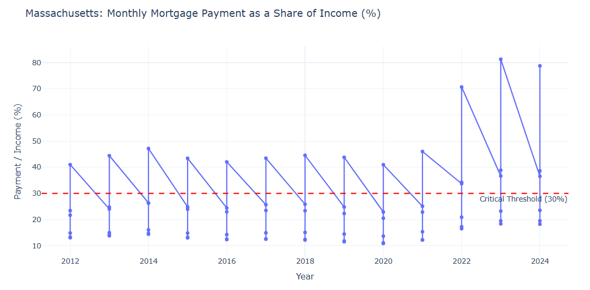
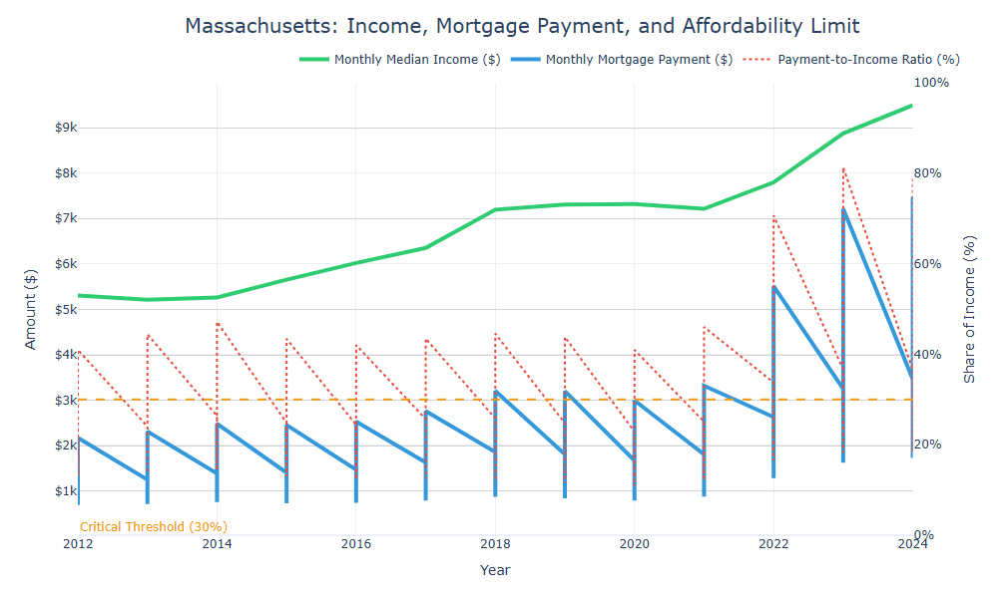
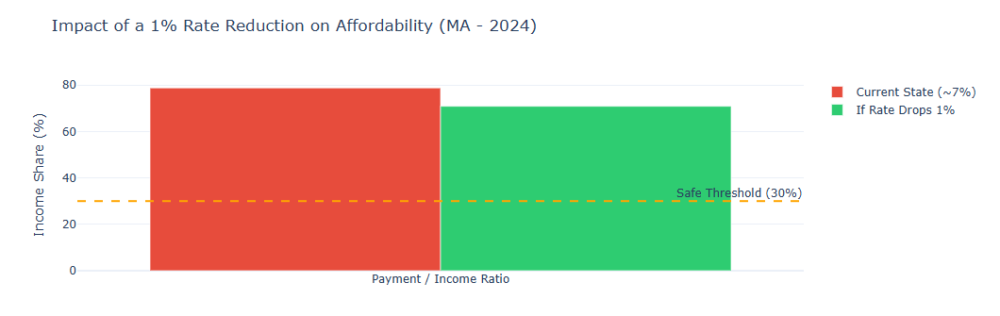
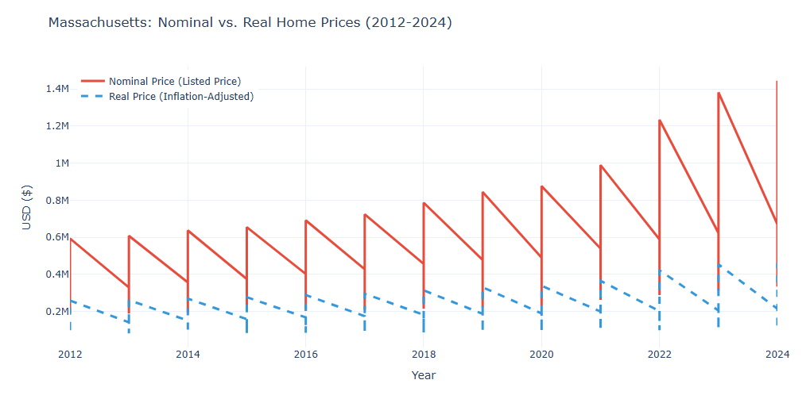

# 🏠 U.S. Housing Market Analysis (2012–2024)
### Zillow Home Value Index × FRED Economic Data

---

## 📌 Project Overview

This project provides a comprehensive data-driven analysis of the U.S. housing market, combining two major public data sources to examine affordability, regional trends, and long-term price forecasts across all 50 states.

The core question driving this analysis: **Is homeownership becoming increasingly out of reach for median-income Americans — and if so, where and by how much?**

To answer this, the project tracks the **Price-to-Income Ratio** (how many years of median income it takes to buy a median-priced home) from 2012 to 2024, with a deep focus on Massachusetts and comparisons to California, Texas, New York, and New England states.

---

## 🎯 Objectives

- Track housing affordability trends across U.S. states over 13 years
- Identify the least affordable metro areas in 2024
- Cluster states into affordability tiers using machine learning
- Forecast future price-to-income ratios using Prophet and Random Forest
- Analyze the real financial burden of homeownership using mortgage rate data
- Separate genuine home value growth from inflation-driven price increases

---

## 📊 Interactive Notebook

> 🔗 **[View the Full Interactive Notebook on Kaggle](https://www.kaggle.com/code/tahirkurtar/zillow-housing-market-analysis?scriptVersionId=304263680)**
>
> The Kaggle version includes fully interactive Plotly charts — animated choropleth maps, hover-enabled scatter plots, and dual-axis mortgage analysis charts. The GitHub version uses static Matplotlib visuals for portability.

---

## 🔍 Key Findings

### 1. Massachusetts Affordability Has Deteriorated Sharply

| Year | Price-to-Income Ratio |
| --- | --- |
| 2012 | 4.82 |
| 2015 | 4.93 |
| 2018 | 4.55 *(temporary dip)* |
| 2021 | 5.53 |
| 2022 | **6.01** *(peak)* |
| 2024 | 5.78 |

MA's ratio rose from **4.82 in 2012 to 6.01 in 2022** — a 25% deterioration in affordability driven by a post-pandemic housing surge.



---

### 2. Multi-State Comparison (MA · CA · TX · NY)

- **California** leads in unaffordability, peaking at **~6.7x** in 2022 and remaining above 5.9x in 2024
- **Massachusetts** closely follows CA, surpassing NY after 2020
- **Texas** and **New York** remain in the 2.2–2.9x range — significantly more affordable relative to income
- Post-2020 divergence is clear: coastal states (MA, CA) accelerated far ahead of inland states (TX, NY)



---

### 3. Top 10 Least Affordable Regions in 2024

| Rank | Region | State | Home Price | Median Income | P/I Ratio |
| --- | --- | --- | --- | --- | --- |
| 1 | Jackson | WY | $1,386,155 | $78,680 | **17.62x** |
| 2 | San Jose | CA | $1,468,193 | $100,600 | 14.59x |
| 3 | Key West | FL | $997,474 | $75,630 | 13.19x |
| 4 | Vineyard Haven | MA | $1,445,307 | $113,900 | 12.69x |
| 5 | Edwards | CO | $1,208,731 | $106,500 | 11.35x |
| 6 | San Francisco | CA | $1,095,400 | $100,600 | 10.89x |
| 7 | Santa Cruz | CA | $1,094,900 | $100,600 | 10.88x |
| 8 | Hailey | ID | $856,824 | $81,650 | 10.49x |
| 9 | Kahului | HI | $1,022,282 | $98,240 | 10.41x |
| 10 | Heber | UT | $1,068,098 | $104,000 | 10.27x |

Jackson, WY leads by a wide margin — a home costs **17.6 years of median income**.



---

### 4. New England Comparison (MA · RI · NH · CT)

- **MA** is consistently the least affordable New England state, reaching 6.0x in 2022
- **RI** has risen sharply post-2020, approaching 5.0x by 2024
- **NH** showed the steepest recent climb, jumping from ~2.6x to 3.7x between 2020–2022
- **CT** remains the most stable, fluctuating between 3.0x and 4.1x



---

### 5. State Clustering (KMeans, k=4)

States were grouped into 4 affordability tiers based on 2024 home price and median income:

| Cluster | Label | Key States |
| --- | --- | --- |
| 0 | **Expensive & Hard to Afford** | MS, WV, AL, AR, KY, LA, NC, NM, OK |
| 1 | **Accessible** | AK, AZ, CT, ID, MD, ME, MT, NH, NJ, NV, OR, RI, VA, VT, WA, WY |
| 2 | **Mid-Range** | FL, GA, IA, IL, IN, KS, MI, MN, MO, ND, NE, NY, OH, PA, SC, SD, TN, TX, WI |
| 3 | **High Income / High Price** | CA, CO, HI, MA, UT |

> Note: Cluster labels are relative to income — Cluster 0 states have low incomes AND high price-to-income ratios, making them structurally unaffordable despite lower nominal prices.



---

### 6. Prophet Forecast — Massachusetts (2025–2027)

| Year | Forecasted P/I Ratio |
| --- | --- |
| 2024 | 5.63 |
| 2027 | **5.88** |

- MA's Price-to-Income ratio is projected to reach **5.88 by 2027** (+4.4%)
- California's ratio is forecast to hit **7.08 by 2027** (+8.1%)
- The upward trend shows no signs of reversal without significant income growth or supply-side intervention



---

### 7. Mortgage & Financial Burden (Massachusetts)

- In 2022, monthly mortgage payments in MA **peaked at ~70% of median monthly income** — more than double the 30% safe threshold
- By 2024, the ratio remains **above 70%** for peak price points
- Monthly median income grew from ~$5,100 (2012) to ~$9,200 (2024), but mortgage payment growth outpaced income growth





**Interest Rate Scenario (2024):**
- At current ~7% rate: payment-to-income ratio ≈ **~79%**
- If rates drop 1%: ratio falls to ≈ **~69%**
- A 1% rate reduction does not restore affordability to the 30% safe threshold



---

### 8. Inflation-Adjusted Home Prices

- Nominal home prices in MA rose dramatically between 2012 and 2024
- When adjusted for CPI (inflation), **real home price growth is more moderate** — but still substantial
- This confirms that a significant portion of the price increase reflects genuine demand and supply imbalances, not just inflation



---

## 🗂️ Analysis Structure

| Section | Description |
| --- | --- |
| **1. Data Collection** | FRED API income data for all 50 states + Zillow ZHVI CSV |
| **2. Zillow Data Processing** | Wide-to-long reshape, date filtering, missing value handling |
| **3. Data Merging & Feature Engineering** | Merge Zillow + FRED, compute Price-to-Income Ratio |
| **4. Affordability Analysis** | State comparisons, top 10 least affordable regions |
| **5. Geographic & Clustering Analysis** | State-level bar charts, KMeans clustering with Elbow method |
| **6. Forecasting** | Prophet time series forecast + Random Forest feature importance |
| **7. Mortgage & Financial Analysis** | Monthly payment burden, scenario analysis, correlation heatmap |
| **8. Inflation-Adjusted Prices** | CPI-deflated real home prices vs. nominal prices |

---

## 🛠️ Methods & Tools

| Category | Tools / Methods |
| --- | --- |
| **Data Collection** | FRED API (`fredapi`), Zillow Research CSV |
| **Data Processing** | `pandas` — melt, merge, interpolation, datetime handling |
| **Visualization** | `matplotlib`, `seaborn` (GitHub) · `plotly` (Kaggle) |
| **Clustering** | KMeans (`scikit-learn`), Elbow method for optimal k |
| **Forecasting** | Meta Prophet, Random Forest Regressor (`scikit-learn`) |
| **Financial Analysis** | Custom mortgage payment calculator, CPI deflation |

---

## 🗃️ Data Sources

| Source | Description | Link |
| --- | --- | --- |
| **Zillow Research** | Metro-level Home Value Index (ZHVI) — `Metro_zhvi_uc_sfrcondo_tier_0.33_0.67_sm_sa_month.csv` | [Kaggle Dataset](https://www.kaggle.com/datasets/zacharysickles/zillow-us-housing-prices) |
| **FRED — Federal Reserve Bank of St. Louis** | Annual median household income by state (`MEHOINUS{STATE}A646N`) | [fred.stlouisfed.org](https://fred.stlouisfed.org/) |
| **FRED — Federal Reserve Bank of St. Louis** | 30-year fixed mortgage rate (`MORTGAGE30US`) | [fred.stlouisfed.org](https://fred.stlouisfed.org/) |
| **FRED — Federal Reserve Bank of St. Louis** | Consumer Price Index (`CPIAUCSL`) | [fred.stlouisfed.org](https://fred.stlouisfed.org/) |

---

## ⚙️ Setup

### 1. Clone the repository
```bash
git clone https://github.com/TahirKurtar/Zillow_Housing_Market_Analysis.git
cd Zillow_Housing_Market_Analysis
```

### 2. Install dependencies
```bash
pip install pandas numpy matplotlib seaborn scikit-learn prophet fredapi plotly
```

### 3. Get a free FRED API key
Register at [https://fred.stlouisfed.org/docs/api/api_key.html](https://fred.stlouisfed.org/docs/api/api_key.html) and replace `YOUR_FRED_API_KEY` in Cell 2 of the notebook.

### 4. Download the Zillow dataset
Download `Metro_zhvi_uc_sfrcondo_tier_0.33_0.67_sm_sa_month.csv` from [this Kaggle dataset](https://www.kaggle.com/datasets/zacharysickles/zillow-us-housing-prices) and place it in the project folder. Update the file path in the notebook accordingly.

---

## 📁 File Structure

```
📁 Zillow_Housing_Market_Analysis
├── 📁 images
│   ├── ma_price_to_income_trend.png
│   ├── multi_state_comparison.png
│   ├── top10_least_affordable.png
│   ├── new_england_comparison.png
│   ├── clustering_scatter.png
│   ├── prophet_forecast.png
│   ├── mortgage_payment_share.png
│   ├── income_vs_mortgage.png
│   ├── interest_rate_scenario.png
│   └── nominal_vs_real_prices.png
├── zillow_housing_market_analysis.ipynb
└── README.md
```

> The dataset file is not included in this repository. See the Setup section above for instructions on how to obtain it.